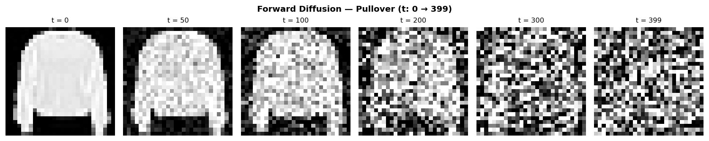
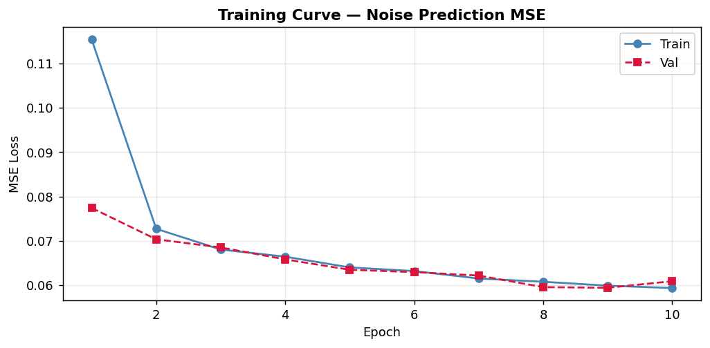
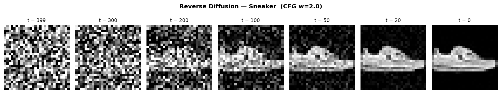
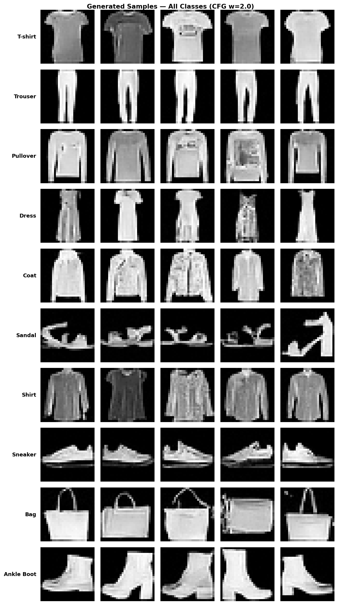
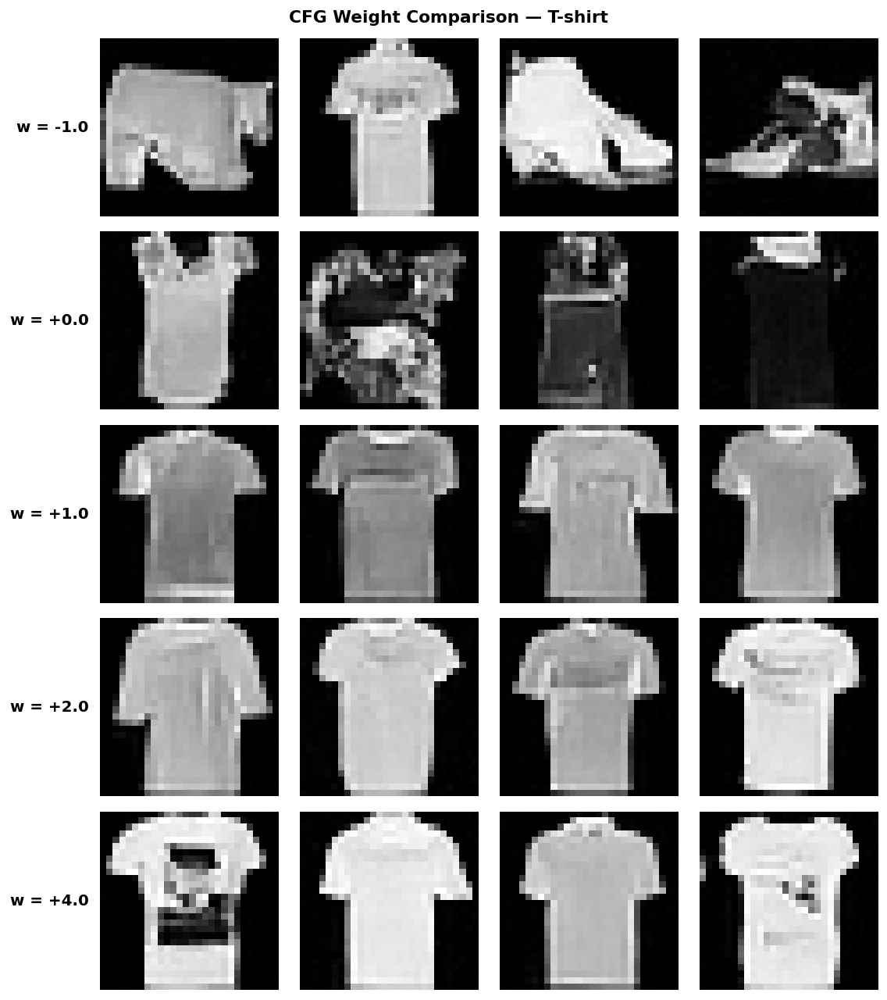

# 🎨 Generative AI with Diffusion Models — From Scratch

### NVIDIA DLI 'Generative AI with Diffusion Models' 커리큘럼을 학습하면서, FashionMNIST 위에서 디퓨전 모델과 Classifier-Free Guidance를 직접 구현해본 학습용 포트폴리오


---

## 📌 프로젝트 요약 (Project Summary)

디퓨전 모델은 처음 접했을 때 발상 자체가 흥미로웠습니다. 이미지에 노이즈를 단계적으로 더해가는 과정은 수식으로 깔끔하게 정의되는데, 그렇다면 거꾸로 노이즈에서 이미지를 복원하는 과정도 학습으로 풀 수 있지 않을까 — 이 단순한 질문이 사실은 디퓨전 모델(DDPM)의 출발점이라는 걸 NVIDIA DLI 커리큘럼을 공부하며 알게 됐습니다.

이번 프로젝트는 강의 코드를 그대로 따라 치는 대신, 라이브러리에 너무 기대지 않고 핵심 개념을 직접 PyTorch로 옮겨보는 것을 목표로 했습니다. FashionMNIST 같은 작은 데이터셋 위에서라도 노이즈 스케줄부터 U-Net 구조, Classifier-Free Guidance까지 한 파일에 통합해서 학습이 끝까지 굴러가는 모습을 직접 확인하고 싶었습니다.

---

## 📂 프로젝트 구조 (Project Structure)

```text
diffusion-models-from-scratch/
├── src/
│   └── main.py                 # 전체 파이프라인 (학습 → 시각화)
├── results/                    # 결과 시각화 5장
│   ├── 01_forward_diffusion.png
│   ├── 02_training_curve.png
│   ├── 03_reverse_trajectory.png
│   ├── 04_generated_samples.png
│   └── 05_cfg_weight_comparison.png
├── .gitignore
├── LICENSE
├── README.md
└── requirements.txt
```

---

## 🎯 학습한 핵심 개념 (Key Concepts)

| 개념 | 짧게 정리 |
| :--- | :--- |
| **U-Net + Skip Connection** | Encoder의 feature를 Decoder에 직접 이어 붙여 세부 정보를 복원 |
| **Forward Diffusion** | 원본 이미지에 노이즈를 단계적으로 더해 망가뜨리는 과정. 수식 한 줄로 임의 t 시점을 바로 계산 |
| **Reverse Diffusion** | 모델이 예측한 노이즈를 빼면서 단계적으로 이미지 복원 |
| **Group Normalization + GELU** | 작은 배치에서도 안정적인 정규화 + ReLU의 "dying neuron" 문제 회피 |
| **RearrangePool** | MaxPool 대신 신경망이 직접 풀링 가중치를 학습 |
| **Classifier-Free Guidance** | 샘플링 시 가중치 `w`로 클래스 조건의 강도를 조절 |
| **Bernoulli Context Mask** | 학습할 때 일부 클래스 정보를 무작위로 0으로 만들어 unconditional도 함께 학습 |

---

## 🏗️ 모델 구조 요약 (Model Architecture)

| 부분 | 구성 |
| :--- | :--- |
| **Encoder** | `ResidualConvBlock` → `DownBlock × 2` (각 `DownBlock`은 conv 2번 + RearrangePool로 크기 1/2) |
| **Bottleneck** | Flatten → Linear MLP → Unflatten |
| **Decoder** | `UpBlock × 2` (ConvTranspose로 크기 2배 + conv 4번) |
| **Skip** | Encoder feature를 Decoder에 concat (총 3회) |
| **Time Embedding** | `t/T` → Sinusoidal sin/cos → Linear |
| **Context Embedding** | `F.one_hot(N=10)` → Bernoulli mask(drop=0.1) → Linear |
| **조건 주입** | `up = c_emb * up_input + t_emb` (디코더 단계마다) |
| **채널 흐름** | 1 → 64 → 64 → 128 → 64 → 64 → 1 |
| **총 파라미터** | **2,547,457 개 (약 2.5M)** |

---

## 📊 학습 결과 (Training Results)

디퓨전 파이프라인이 실제로 학습이 되는지 동작 검증을 우선 목표로 잡아 10 Epoch만 짧게 학습했고, GPU에서 약 1분이면 끝나는 분량입니다. Train Loss는 0.1153 → 0.0594로 약 49% 감소했고, Train과 Val 곡선이 거의 겹쳐서 과적합 없이 안정적으로 수렴했습니다.

| Epoch | Train Loss | Val Loss |
| :---: | :---: | :---: |
| 1  | 0.11536 | 0.07740 |
| 2  | 0.07271 | 0.07034 |
| 3  | 0.06804 | 0.06851 |
| 4  | 0.06642 | 0.06581 |
| 5  | 0.06401 | 0.06347 |
| 6  | 0.06318 | 0.06295 |
| 7  | 0.06150 | 0.06216 |
| 8  | 0.06077 | 0.05956 |
| 9  | 0.05988 | 0.05941 |
| **10** | **0.05935** | **0.06090** |

---

## 🔍 시각화 결과 분석 (Visualization Analysis)

| # | 단계 | 결과 | 관찰 포인트 |
| :---: | :--- | :---: | :--- |
| **1** | **Forward Diffusion**<br>노이즈가 더해지는 과정 |  | • `t=0`에서는 Pullover의 형태가 또렷이 보임<br>• `t=50`부터 표면 텍스처가 흐려지고, `t=100`에서는 형태는 인식 가능하지만 표면 디테일이 거의 사라짐<br>• `t=200` 이후로는 거의 노이즈 — 원본 정보가 사실상 사라짐<br>• 단계마다 직접 노이즈를 더한 게 아니라, **수식 한 줄로 임의 t 시점을 한 번에 계산**한 결과 |
| **2** | **Training Curve**<br>학습이 잘 됐다는 증거 |  | • 초반(Epoch 1 → 2)에 Loss가 가장 큰 폭(0.115 → 0.073)으로 떨어진 후 점차 평탄해짐<br>• Epoch 3 이후로는 Train(파랑) / Val(빨강) 두 곡선이 거의 겹쳐서 함께 내려감 → 과적합 없이 잘 일반화됨<br>• Epoch 9에서 Val Loss 최저(0.0594), Epoch 10에서 살짝 반등 — 학습 후반부에 학습률이 줄어들면서 수렴 영역에 들어선 모습 |
| **3** | **Reverse Diffusion**<br>노이즈에서 이미지로 복원<br>(클래스: Sneaker, CFG `w=2.0`) |  | • `t=399 ~ 200` 구간: 거의 노이즈로 보이지만, 모델은 매 스텝 노이즈를 조금씩 빼고 있음<br>• `t=100` 부근: 신발 윤곽이 처음으로 보이기 시작 — **형태가 떠오르는 분기점**<br>• `t=50 ~ 0`: 짧은 구간 안에서 디테일이 빠르게 선명해짐<br>• 마지막 `t=0`에서 신발 몸체, 밑창, 윗부분 디테일 등 운동화의 주요 구조가 구분<br>• Forward와 Reverse가 정반대 방향으로 흐른다는 게 한눈에 들어옴 |
| **4** | **Generated Samples**<br>10개 클래스 모두 생성<br>(CFG `w=2.0`) |  | • 10개 클래스 모두 식별 가능한 형태로 생성됨 → 클래스 조건부 생성이 의도대로 작동<br>

• 가장 잘 나온 클래스: **Sneaker, Trouser, Bag, Ankle Boot**<br>• 흐릿한 클래스: **Pullover, Coat, Shirt** — 상의류는 서로 형태가 비슷해 가장 어려운 카테고리<br>• **카테고리 혼동 사례**: Sandal의 마지막 샘플은 굽 있는 신발 형태로 새는 등, 10 Epoch의 한계가 일부 보임<br>• 노이즈에서 시작해 한 번도 본 적 없는 새 의류 이미지를 만들어냈다는 점에서, **생성 모델이 실제로 작동함을 직접 확인** |
| **5** | **CFG Weight 비교**<br>guidance weight `w` 효과<br>(클래스: T-shirt) |  | • `w=−1.0`: T-shirt와 무관한 가방·신발 → 클래스 정보가 반대로 작용<br>• `w=0.0`: T-shirt와 다른 카테고리가 섞여서 등장 → 클래스 정보 무시<br>• `w=+1.0`: 깔끔한 T-shirt로 수렴 → 클래스 정보가 약하게 반영<br>• `w=+2.0`: 더 선명하고 일관된 T-shirt → **권장 구간** (품질-다양성 균형)<br>• `w=+4.0`: T-shirt 윤곽이 거의 표준화되고 일부에 강한 디자인(프린트)이 강조됨 → 클래스가 너무 강해 형태 다양성 ↓<br>• `w`가 커질수록 선명해지지만 다양성은 줄어드는 trade-off가 한 그림에 명확히 드러남 |

---

## 💡 회고록 (Retrospective)

처음 디퓨전 모델을 공부할 때 GAN과 비교하면 잘 와닿지 않았습니다. GAN은 Generator와 Discriminator가 서로 경쟁하면서 이미지를 만들어낸다는 직관적인 그림이 있는데, 디퓨전은 그저 "노이즈를 예측하도록 학습한다"는 설명이 처음엔 너무 단순해 보였습니다. 이렇게 단순한 학습 목표만으로 어떻게 이미지가 생성될까 하는 의구심이 있었는데, 직접 코드로 옮겨보고 나서야 그 단순함이 오히려 이 모델의 강점이라는 걸 알게 됐습니다. GAN처럼 두 모델이 서로 균형을 맞추는 불안정한 학습이 아니라, 한 모델이 한 가지 목표만 학습하면 되니 학습 곡선이 훨씬 안정적으로 떨어지는 것을 직접 보고 나서야 그 차이가 체감됐습니다.

코드를 짜기 전에는 모델이 깨끗한 이미지를 직접 예측하면 될 것 같았는데, 실제로 구현해보면서 왜 "노이즈"를 예측 대상으로 삼는지 알게 됐습니다. 노이즈는 이미 가우시안 분포라서 모델 출력의 분포가 일정하지만, 깨끗한 이미지는 카테고리마다 분포가 달라서 학습 신호가 들쑥날쑥해집니다. 결국 노이즈 예측은 학습 난이도를 일정하게 유지하기 위한 영리한 선택이었던 셈인데, 이런 작은 설계 결정 하나가 학습 안정성과 직결된다는 점이 흥미로웠습니다.

제일 처음으로 인상 깊었던 부분은 Forward Diffusion 수식이었습니다. `x_t = √ᾱ_t · x_0 + √(1-ᾱ_t) · ε` 한 줄로 t 시점의 노이즈 이미지를 반복 없이 단번에 구할 수 있다는 사실이 처음엔 잘 믿기지 않아서, t=100 상태를 100번 반복해서 만든 결과와 공식 한 번으로 만든 결과를 직접 비교해본 뒤에야 납득이 됐습니다. 만약 매 스텝마다 노이즈를 누적해서 만들어야 했다면 학습 시간이 수백 배는 늘어났을 텐데, 이 한 줄 덕분에 임의의 t에 대해 즉시 학습 데이터를 만들 수 있다는 점이 수학이 곧장 학습 효율로 이어지는 좋은 예시처럼 느껴졌습니다.

U-Net의 Skip Connection도 직접 빼봐야 그 중요성을 알 수 있었습니다. 처음에 Encoder-Decoder만으로 돌렸을 때 디코더가 세부 정보를 복원하지 못하고 흐릿한 결과만 내놓았는데, Encoder feature를 Decoder에 그대로 이어 붙이는 것만으로 결과가 눈에 띄게 좋아져서 왜 이 구조가 이미지 복원 작업에서 표준이 되었는지 실감했습니다. 비슷한 맥락에서 타임스텝 임베딩도 처음엔 t를 정수로 그냥 넣으면 될 것 같았는데, 모델이 t=399와 t=1을 같은 네트워크 하나로 처리해야 하니 "지금이 어느 단계인지" 알려주는 신호가 필수라는 걸 코드로 확인했습니다. Sinusoidal 임베딩으로 t를 sin/cos 벡터로 바꿔주면 모델이 시간 정보를 일종의 주파수 좌표처럼 받아들여 단계별로 다른 동작을 할 수 있게 된다는 점이 흥미로운 트릭이었습니다.

가장 공부가 됐던 최적화 기법은 RearrangePool이었습니다. 처음엔 MaxPool로도 충분할 것 같았는데, 디퓨전 모델은 결국 이미지를 복원하는 모델이라 다운샘플링에서 정보를 어떻게 줄이느냐가 결과 품질에 직결됩니다. MaxPool은 단순히 가장 큰 값만 고르기 때문에 위치 정보가 거칠어지고, 업샘플링 단계에서 격자 무늬 같은 잡음이 생기기 쉽습니다. RearrangePool은 공간 축을 채널 축으로 옮긴 뒤 conv가 직접 풀링 가중치를 학습하게 만드는 방식인데, "어떤 픽셀을 고를지를 신경망이 결정하게 한다"는 발상 자체가 신선했고, 이걸 적용했을 때 격자 무늬가 거의 사라지는 것을 실제로 확인할 수 있었습니다.

Classifier-Free Guidance(CFG)는 이번 프로젝트에서 가장 흥미로웠던 파트입니다. 분류기가 따로 없는데도 분류기가 있는 것처럼 작동한다는 발상이 매우 깔끔했습니다. 학습할 때 일부 샘플의 클래스 정보를 무작위로 마스킹해서 conditional/unconditional 두 경우를 한 모델이 같이 배우게 하고, 샘플링할 때 두 출력의 차이를 가중치로 증폭하는 방식입니다. 특히 샘플링 시 배치를 두 배로 복제해 한 번의 forward로 두 종류의 노이즈 예측을 동시에 얻는 트릭은, 이런 작은 효율화가 추론 속도를 절반으로 줄여준다는 게 굉장히 실용적이었습니다. 또한 디코더에 시간(`t_emb`)과 클래스(`c_emb`)를 주입할 때 단순히 더하지 않고 `c_emb * up + t_emb` 형태로 곱과 합을 분리해서 쓰는 부분도 처음엔 의아했지만, 곱하는 쪽은 강도, 더하는 쪽은 방향 역할을 한다는 걸 알고 나니 두 정보를 모델이 다르게 해석하도록 유도한 설계라는 게 보였습니다.

학습 곡선만 보고 "Loss가 0.06이니 잘 학습된 것 같다"고 판단하는 건 단편적이었습니다. 실제로 Reverse Diffusion 궤적을 시각화하니 t=100 부근에서 형태가 떠오르는 분기점이 명확히 보였고, CFG `w` 값을 바꿔가며 생성한 결과를 한 그림에 늘어놓고 나서야 "선명함과 다양성의 trade-off"가 단순한 이론이 아니라 실제로 눈에 보이는 현상이라는 걸 체감할 수 있었습니다. 숫자만으로는 모델이 무엇을 잘하고 무엇을 못하는지 알기 어렵다는 것, 그래서 시각화가 단순한 결과 정리가 아니라 디버깅의 핵심 도구라는 걸 이번 프로젝트를 통해 배웠습니다.

물론 아쉬운 점도 많습니다. 10 Epoch이라는 짧은 학습으로는 생성 이미지가 아직 다소 흐릿하고, 클래스 간 경계가 분명하지 않은 결과(Sandal 카테고리에 굽 있는 신발이 섞여 나오는 현상 같은)도 있었습니다. 더 많은 타임스텝(T=1000), Self-Attention 레이어 추가, Cosine Noise Schedule 같은 개선 여지가 보이는데 이 부분은 다음 단계로 남겨두려고 합니다. 또 사전학습 CLIP 모델과 연결해 텍스트로 이미지를 생성하는 파이프라인도 직접 시도해보고 싶습니다. 이 프로젝트는 가장 작은 형태의 구현이지만, 나중에 Stable Diffusion 같은 큰 모델의 코드를 봤을 때 어떤 부분이 어떤 역할을 하는지 빠르게 이해할 수 있는 토대가 된 것 같습니다.

가장 큰 수확은, API를 호출해서 결과만 보던 입장에서 벗어나 노이즈 한 번을 더하고 빼는 수식 단계부터 직접 코드로 옮겨봤다는 점입니다. "이 모델은 이렇게 작동한다"는 설명을 들을 때 머리로만 이해했던 것이, 한 줄 한 줄 직접 짜보고 시각화로 확인하면서 비로소 손에 잡히는 지식으로 바뀐 느낌입니다. 앞으로 더 큰 모델을 다루게 되더라도, 이번에 쌓은 "수식을 코드로 옮기고 시각화로 검증하는" 흐름이 새로운 모델을 빠르게 흡수하는 데 든든한 토대가 될 거라고 생각합니다.
